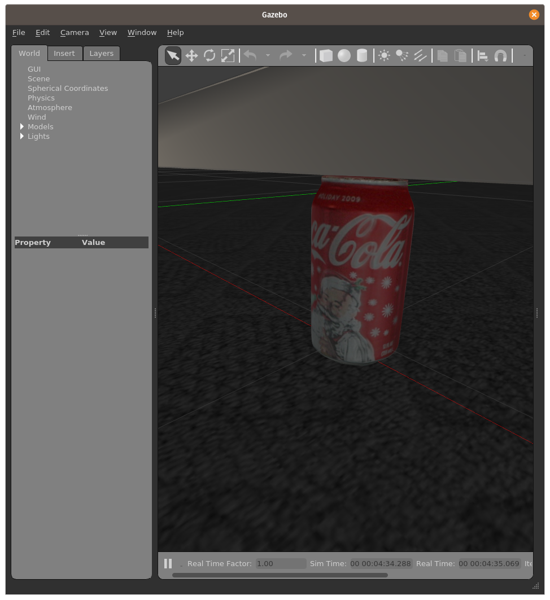

# Coke can to detect

A large part of the challenge is based on the capability the robot have to detect specific elements in it environment.

For those challenge we propose to focus the detection problem on a particular soda can.



To notice that in gazebo, object model is both a 3D visual description and a 3d physical description (collision bounding box, mass, inertia...).


## Gazebo Spawn Model.


You can spawn soda cans in our world (or any other 3D models) by using the `spawn_model` node in `gazebo_ros` packages.

The node takes at list **3** parameters.

1. the model definition (with `-file Path/to/the/file`)
2. the model definition type (`-sdf` if sdf)
3. and a unique id in the world (with `-model model_id`)

For instance, to spawn the soda can **from the user directory**:

```bash
rosrun gazebo_ros spawn_model -file simulation_ws/src/larm/models/coke_can/model.sdf -sdf -model can_1
```

`Spawn model` proposes several complementary argument, the most relevant for us permit defining the expected pose:

* -x XX -y YY -z zz(x, y and z coordinates in meters)
* -R RR -P PP -Y YY (the roll, pitch and yaw rotations in radians)

More on [Wiki ROS](https://wiki.ros.org/simulator_gazebo/Tutorials/SpawningObjectInSimulation) and the (source code)[https://github.com/ros-simulation/gazebo_ros_pkgs/blob/jade-devel/gazebo_ros/scripts/spawn_model]


## By using ROS tools


First you call the `spawn_model` node from anywhere while the models are referenced in ROS package by using `rospack find`

```bash
rosrun gazebo_ros spawn_model -file `rospack find larm`/models/coke_can/model.sdf -x 0.5 -y 0.5 -sdf -model can_2
```

You can also include the spawner in a launch file cf. (`spawn_bottle.launch` in `larm` package)

```xml
<launch>
	<arg name="name" default="can_X" />
	<arg name="x" default="0.0" />
	<arg name="y" default="0.0" />
	<arg name="roll" default="0.0"/>
	<arg name="pitch" default="0.0"/>
	<arg name="yaw" default="0.0"/>

<node name="Spawner4" pkg="gazebo_ros" type="spawn_model" output="screen" args="-file $(find larm)/models/coke_can/model.sdf -sdf -model $(arg name) -x $(arg x) -y $(arg y)" />
</launch>
```

## Configuration and Fakes

Ideally, the cans hare detected in different poses, whatever the background and with partial obstructions. In contrary, the system has to avoid false positive (wallpaper publicity, other objects...)
