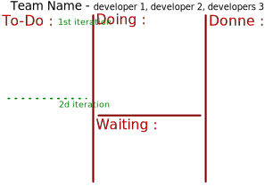

# Challenge

The challenge aims to put learners in the development of a micro robotic project.
In the end, both the execution of the proposed solution and the source code with documentation would be evaluated.

The main objectives of the project consist of:

- Control a robot in a cluttered environment
- Map a static environment
- Detect all the **NukaColas**
- Estimate the position of the **NuKaColas** in the map
- Optimaze the exploration strategy

<https://www.myminifactory.com/object/3d-print-fallout-nuka-cola-15616>

## Agile software development

Agile software development aims to break with traditional project management by preferring:

- **Individuals and Interactions** over processes and tools
- **Working Software** over comprehensive documentation
- **Customer Collaboration** over contract negotiation
- **Responding to Change** over following a plan

On [WikiPedia](https://en.wikipedia.org/wiki/Agile_software_development).

### Iterative development

The clear objective for a team of developers intents more efficient software development.
The main feature consists of iterative development
by moving forward incrementally
and by delivering operational versions punctually.

For this project, development is split in two iterations.
A first action would be to prepare a board to help the team on it organization.

This board is composed by **6** areas:

- *Team name*: and developers' name.
- *to-do - 1st it*: List of tasks to perform before the end of the first iteration (**the 7th of January**)
- *to-do - 2d it*: List of tasks to perform before the end of the second and last iteration (**the 15th of January**)
- *Doing*: List of tasks the team is working on
- *Waiting*: List of tasks waiting for an external input
- *Donne*:  List of terminated tasks

A team is composed of:

- The developers (2 or 3)
- The external observers (teachers)
- The colleges (they help because they aim you succeed (but not as the winner), and they have their own project to work on)

### Project decomposition

Then the project is decomposed in several components to develop in order to reach the project objectives.
The main objective is to fill the team board with the components to develop, at least for the first iteration.

A component need to be

- *Idenpedent*: It development do not require that another component to be developed at the same time.
- *Verifiable*: It is possible to test if the component work correctly.
- *Complete*: Each time a component is terminated, the project status is operational and could be released.

Define the components to develop, at least to reach a first milestone: *"a robot capable of navigating in an environment with obstacles"*.
Ideally, each component matches a functionality for the robot, implemented as a *ROS* node.
Select in the *to-do - 1st it* area of your *team board* all the components you will develop during the first iteration.
Let the other component for the second iteration.
To notice that, the component to develop during the second iteration would be refined at the end of the first iteration.

## Versioning and sharing

git + gitlab or github or bitbucket.

README.md

*2* branches (master and dev)

## Go go go...

A component development is generally composed by **5** tasks to perform in a specific order:

- Defining and implementing the test procedures that would validate the efficiency of the component.
It is a good practice (named [test-driven development)[https://fr.wikipedia.org/wiki/Test_driven_development]) to set up the test before to start any development.
- Developing the component in a way the component passes all the tests.
- Testing the overall solution. Redo the test of all the already released components to validate that the development of the new component has not broken anything.
- Updating the documentation.
- Releasing the actual version (if all tests are green). In our case, it consists of merging the *dev* branch into the *master* branch, in order to always keep a working version on the *master* branch.

So, you just have to select a first component to develop, put it in the *doing* areas of your *team board*, and let go...
