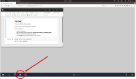
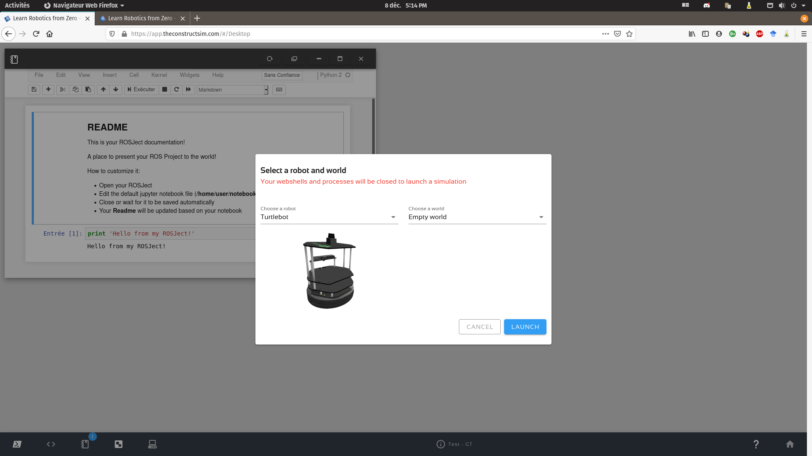

# Simulate a turtlebot2

The first step in the challenge is to get control over a turtlebot2 robot equipped with a standard plan laser.

## Robot configuration 

Turtlebot is a simple robot very similar than small home-cleaning robot, but with a connection panel allowing hacking its sensors and actuators. 

More detail on [the official web site](https://www.turtlebot.com/turtlebot2/).

Basically, the turtlebot is equipped with sonars and a 3D camera. The robot version to use is also equipped with a scanning rangefinder like the one proposed by [hokuyo](https://www.hokuyo-aut.jp/search/single.php?serial=166).
Those solutions are also well supported in [ROS](https://wiki.ros.org/urg_node).

## On TheConstruct RDS

TheConstruct RDS provides built in the gazebo simulation with turtlebot2 robots (on Kinetic).
You can start the simulation from your fresh gited ROSject (Kinetic - No template) through the simulation button.



Then select the turtlebot robot in an empty world.



Finally, you will be capable of spawning some obstacles to avoid.


## Avoid obstacles

The solution development for the challenge can begin.
The first mission would be to permit the robot to move from its start position toward a goal position by avoiding the obstacles.
A quick look at the available ROS topics permit to identifiate entrances for control and scan.

```bash
rostopic list
```
