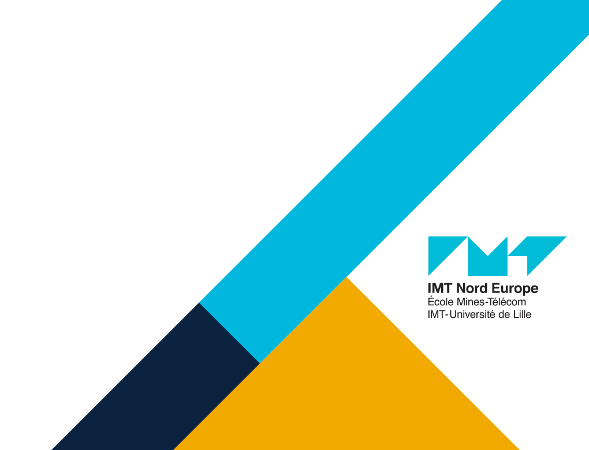

# UV LARM 
### Logiciel et Architecture pour la Robotique Mobile
### An introduction

 
 

**Guillaume Lozenguez**
[@imt-nord-europe.fr](mailto:guillaume.lozenguez@imt-nord-europe.fr)

---

1. **What is a Robot ?**
2. **About the UV LARM**
3. **Today: First contact with Linux and ROS**

---

1. - **What is a Robot ?**
2. **About the UV LARM**
3. **Today: First contact with Linux and ROS**

---
<!-- --------------------------------------------------------------- -->

## What is a Robot ?

### On Wikipedia:

**en**

"A robot is a machine—especially one programmable by a computer— capable of carrying out a complex series of actions automatically."

**fr**

"Un robot est un dispositif mécatronique (alliant mécanique, électronique et informatique) conçue pour accomplir automatiquement des tâches imitant ou reproduisant, dans un domaine précis, des actions humaines."

---

## What is a Robot ?

### From my point of view

"A **robot** is a **mechatronics** machine capable of autonomously acting in a real environment."

- perceives with *sensors*
- models its environment and adapts its behavior
- acts with *actuators*

generally involves Artificial-Intelligence:

- capable to mimic natural (human, animal, insect,...) intelligence

---

## Some examples

Macro: a large variety of robots

---

## Some examples

Micro: a large variety of components.

---

## From a mechanic point of view

### Focus on:

- Resistance
- Weight
- Distortion
- Vibration absorption
- Machining, Assembly

### for different robots:

- Fast
- Precise
- Strong
- resistant (dust, water,...)
- safe
- less expensive

*From an electronic point of view*

Focus on sensors, motor, energy systems and hardware.

---

## From a automation point of view

### Focus on:

- Physics science
- Signal processing
- Control system

### by manipulating

- Times series, torques
- Vector, Matrices

---

## From a software point of view

### Focus on:

- Algorythms
- Knowledge representation
- Artificial intelligence
- Software architecture

Robots are complex and singular systems  
which require modular computer programs.

---

1. **What is a Robot ?**
2. - **About the UV-LARM**
3. **Today: First contact with Linux and ROS**

---

## UV-LARM

#### Software and Architecture for Mobile Robots

**Mostly about:** autonomous navigation.

- Communicate with robot components
- Control robot movements (nonholonomic robot)
- Perception of the local environment (laser, vision)
- SLAM (Simultaneous Localization and Mapping)
- Path finding and navigation.

---

## UV-LARM

#### Software and Architecture for Mobile Robots

**With a central need:** modular software

- An expected complex global behavior 
- Splited in piece of programs (modules)
- Communicating together
- With dedicated tasks (sensor driver, reprensentation, planning, controling...)
- And a bunch of tools making all working together...

---

## UV-LARM - Schedule

 

*1st week:* Introduction, simulation and movement.

*2d week:* Vision and Mapping.

*3d week:* Challenge as your project.

*4th week:* Evaluation through the code you provide.

- Always from *9:00* to *12:00* and from *14:00* to *17:30*.
- In *Develter* and *3005*.
- With or without a teacher.

---

## Using ROS API:

**ROS:** The Robot Operating System (ROS) is a set of *software libraries* and *tools* that help you build robot applications.

- The number one Robotic Middle Ware used in academic
- Open and oriented toward its *many contributors*
- Supported by a large number of professional companies

It permits thinking robotic programs in a modular way as independent programs: *nodes* working together by communicating through *topics*.

It comes with useful functionality like *frame* management and *transform*

---

##  ROS API:

### Tools:

To start nodes, to connect them, to visualize the architecture and the data in the pipes (topics).

### An API and Libs:

To develop its own nodes, to use topic-based communication, to help in manipulating spatio-temporal data.

### A community:

To share our contribution and use the one from pairs [wiki.ros.org](https://wiki.ros.org)

---

## Why Ubuntu Linux:

 
 

**Because**

- We love *GNU* (and open source in general)
- ROS supports natively Ubuntu Linux
- _And mainly:_ Linux is efficient and well documented

---

## Evaluation:

 

**3 Chalenges**

- Navigate in a cluttered environment.
- Map an unknown  environment and retrieve treasures.
- Make autonomous exploration.

 

**2 Environments**

- Robot: Turtlebot
- Simulation: Gazebo

---

1. **What is a Robot ?**
2. **About the UV LARN**
3. - **Today: First contact with Linux and ROS**

---

## Today:

### [Wiki ROS](http://wiki.ros.org/) Beginner tutorials:

- Create a ROS project (catkin)
- Implement communicating nodes (publisher and subscribers)

### But first : Let play a little with Linux and its Terminal:

- Setup tutorial on gitbook: <https://ceri-num.gitbook.io/uv-larm/>
