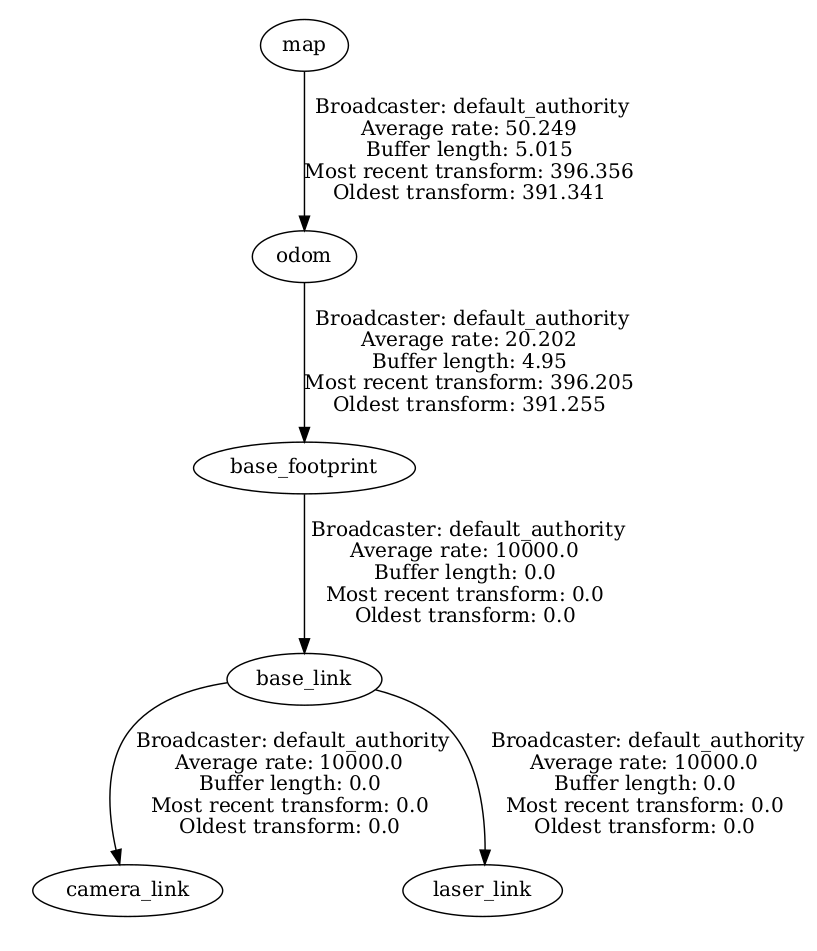

# What is SLAM in a Nutshell?

Mobile robots rely heavily on accurate representations of the environment (i.e *maps*) to fulfill their tasks (autonomous navigation, exploration, ...). Inside buildings, GPS signals are too weak to be used to localize robots. Hence we face a so-called Chicken-and-Egg-Problem, as *localization* requires a map, and map building (i.e. *mapping*) requires the current location.
One solution consists in doing *Simultaneous Localization and Mapping* (a.k.a. SLAM) using a SLAM algorithm that typically reaches centimetric precision.

There are many different flavors of SLAM especially regarding the map format. The dominating 2D map format is the occupancy grid, also called grid map. A grid map is a matrix whose cells represents a defined region of the real world; this is the *resolution* of the grid map (typically a square of 5cm). A cell holds the estimated probability that the space it represents is traversable (free space) or not (obstacle). The simplest format is the 3-state occupancy grid in which a cell has 3 different possible values: 0 (free space), 0.5 (unknown) and 1 (obstacle).


<!-- Localization
- Dead Reckoning
- Particle Filters
- Kalman Filters
- Pose Graph Optimization
- Scan matching -->

[Transformations doc](https://navigation.ros.org/setup_guides/transformation/setup_transforms.html)


# Map building using `slam_toolbox`

There are a lot of different SLAM algorithms and some implementations are open source and available on [OpenSLAM](https://openslam-org.github.io/).

We will use here the [`slam_toolbox`](https://github.com/SteveMacenski/slam_toolbox) ROS implementation (documentation is [here](https://navigation.ros.org/tutorials/docs/navigation2_with_slam.html)).

## Launch `slam_toolbox`

```console
ros2 launch tbot_sim challenge-1.launch
```

```console
ros2 launch slam_toolbox online_sync_launch.py use_sim_time:=False
```

```console
rviz2
```

> Question: using all the tools you already know (`rviz2`, `rqt_graph`, tf, ...), what are the input and output data of `slam_toolbox`?


## Manual Mapping

Launch a teleop:

```console
# keyboard
ros2 run teleop_twist_keyboard teleop_twist_keyboard

# or xbox
ros2 launch teleop_twist_joy teleop-launch.py joy_config:=xbox
```

Now, while moving the robot around the simulated environment, you should see the result of `slam_toolbox` (both the map and robot pose) updated in `rviz2`.


<!--  -->




# Autonomous Navigation sending goal points

> Facultative part

```
ros2 launch nav2_bringup navigation_launch.py
```

Be carreful, navigation should publish in the right topic so that the robot receive command velocities.
Then, send goal points into `/goal_pose` (use rviz2)

# Save the Map

```console
ros2 run nav2_map_server map_saver_cli -f /home/bot/map
```

> Sometimes this command produces a timeout. This is because it listens to the `map` topic no map is received during a certain amount of time and we cannot extend this delay...

Another solution to save the map is to use the following service call:

```console
ros2 service call /slam_toolbox/save_map slam_toolbox/srv/SaveMap "name: {data: '/home/bot/map2'}"
```

<!-- # All in one

Stop everything.

```
ros2 launch nav2_bringup slam_launch.py
```

Then, map can be saved using:

```

``` -->

# Load a map and Localize in it

To load a map and localize in it, you should:

1. execute:

```
ros2 launch nav2_bringup localization_launch.py map:=/home/bot/map.yaml autostart:=True
```

2. publish an approximate initial pose into the topic `/initialpose` (using rviz2 for example)

3. move the robot around (teleop or so) to improve the acuracy of the localization

# Load a map and Localize in it __in simulation__

Same steps as above but the time is simulated:

```
ros2 launch nav2_bringup localization_launch.py map:=/home/bot/map.yaml autostart:=True use_sim_time:=True

rviz2 --ros-args --remap use_sim_time:=True
```

# Bag files (`ros2 bag`)

Working in simulation is nice but we can do better and work directly on real data using the `ros2 bag` command tool.
The idea is to record some topics (all data that goes through) into a [bag file](http://wiki.ros.org/Bags) and play them later on.
Bag files are really useful to test algorithms on real data sets that have been recorded in a specific location and with  specific sensors.
Moreover, there are a lot of public datasets available:

- [http://radish.sourceforge.net/]
- [https://vision.in.tum.de/data/datasets/rgbd-dataset/download]
- [http://www.ipb.uni-bonn.de/datasets/]
- [http://car.imt-lille-douai.fr/polyslam/]


Use the [tutorial on rosbag](https://docs.ros.org/en/iron/Tutorials/Beginner-CLI-Tools/Recording-And-Playing-Back-Data/Recording-And-Playing-Back-Data.html) to learn how to use it.

> Work: Launch the challenge 2 simulation, record `/tf` and `/scan` into a rosbag and teleop the robot all around the map. You now have a dataset ready to do offline SLAM.

# Offline Mapping

> Work: Play the rosbag created before and launch `slam_toolbox` in offline mode to create the map and then save it. You can now load this map to localize the robot into it.

# Map a real arena

Re-do exactly the same things to map an existing arena:

1. Put the robot inside the arena
2. Record a bag file with all needed data to achieve SLAM
3. Manually teleoperate the robot everywhere in the arena
4. Save the bag file
5. Play the bag file and launch the SLAM to create a map and save it (offline mapping)
6. Put the robot inside the arena and load the map to localize the robot inside the arena

>Hint: `slam_toolbox` comes with a RViz plugin (Panels->Add New Panel->slam_toolbox->SlamToolboxPlugin) that might help

# Tuning map quality

SLAM algorithms usually have a lot of parameters that can be tuned to improve performance or map quality.
`slam_toolbox` is no exception. Some hints [here](https://www.robotandchisel.com/2020/08/19/slam-in-ros2/).

<!-- Comparing resulting maps and localization:
- cite Sang's paper
- Python package for the evaluation of odometry and SLAM
https://michaelgrupp.github.io/evo/ -->
