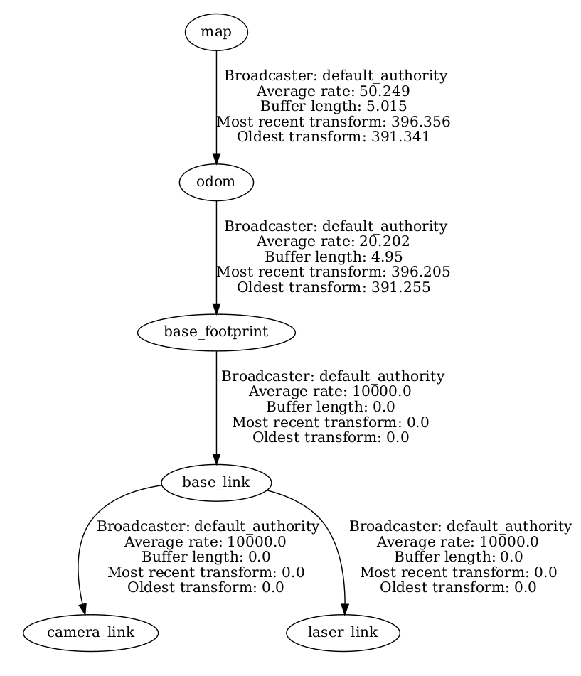

# What is SLAM in a Nutshell?

Mobile robots rely heavily on accurate representations of the environment (i.e *maps*) to fulfill their tasks (autonomous navigation, exploration, ...). Inside buildings, GPS signals are too weak to be used to localize robots. Hence we face a so-called Chicken-and-Egg-Problem, as *localization* requires a map, and map building (i.e. *mapping*) requires the current location.
One solution consists in doing *Simultaneous Localization and Mapping* (a.k.a. SLAM) using a SLAM algorithm that typically reaches centimetric precision.

There are many different flavors of SLAM especially regarding the map format. The dominating 2D map format is the occupancy grid, also called grid map. A grid map is a matrix whose cells represents a defined region of the real world; this is the *resolution* of the grid map (typically a square of 5cm). A cell holds the estimated probability that the space it represents is traversable (free space) or not (obstacle). The simplest format is the 3-state occupancy grid in which a cell has 3 different possible values: 0 (free space), 0.5 (unknown) and 1 (obstacle).


<!-- Localization
- Dead Reckoning
- Particle Filters
- Kalman Filters
- Pose Graph Optimization
- Scan matching -->

# Map building using `slam_toolbox`

There are a lot of different SLAM algorithms and some implementations are open source and available on [OpenSLAM](https://openslam-org.github.io/).

We will use here the [`slam_toolbox`](https://github.com/SteveMacenski/slam_toolbox) ROS implementation (documentation is [here](https://navigation.ros.org/tutorials/docs/navigation2_with_slam.html)).

## Launch `slam_toolbox`

```console
ros2 launch tbot_sim challenge-1.launch
```

```console
ros2 launch slam_toolbox online_sync_launch.py
```

```console
rviz2
```

> Question: using all the tools you already know (`rviz2`, `rqt_graph`, tf, ...), what are the input and output data of `slam_toolbox`?


## Manual Mapping

Launch a teleop:

```console
# keyboard
ros2 run teleop_twist_keyboard teleop_twist_keyboard

# or xbox
ros2 launch teleop_twist_joy teleop-launch.py joy_config:=xbox
```

Now, while moving the robot around the simulated environment, you should see the result of `slam_toolbox` (both the map and robot pose) updated in `rviz2`.


<!--  -->



# Bag files (`ros2 bag`)

TODO: Save and Replay Data using

<!-- Working in simulation is nice but we can do better and work directly on real data using the `rosbag` command tool.
With the [rosbag command](http://wiki.ros.org/rosbag/Tutorials/Recording%20and%20playing%20back%20data), you can record some topics (all data that goes through) into a [bag file](http://wiki.ros.org/Bags) and play them later on.
Bag files are really useful to test algorithms on real data sets that have been recorded in a specific location and with  specific sensors.
Moreover, there are a lot of public datasets available:

- [http://radish.sourceforge.net/]
- [https://vision.in.tum.de/data/datasets/rgbd-dataset/download]
- [http://www.ipb.uni-bonn.de/datasets/]
- [http://car.imt-lille-douai.fr/polyslam/]

First, follow the [GMapping tutorial using a rosbag](http://wiki.ros.org/slam_gmapping/Tutorials/MappingFromLoggedData).


Write and commit your own launch file named `gmapping_rosbag.launch` into the `larm1_slam` catkin package that launches a GMapping on a specific bagfile (I suggest the [DIA 1st floor](http://car.imt-lille-douai.fr/johann/turtlebot_dia.bag.gz)). This launch file should open an Rviz to see the map construction.


```console
# launch GMapping on the DIA bag file
$ roslaunch larm1_slam gmapping_rosbag.launch
```

When the rosbag has finished to play, you can save the GMapping resulting map using the following command:

```console
# save the GMapping map into a file
$ rosrun map_server map_saver -f dia
```

You will get two files named `dia.pgm` and `dia.yaml`.
The first one is an image format representing the 3-state occupancy grid.
The second one is a text format that contains metadata of the generated map: resolution, ...

Then, you can work on your own rosbag, generated by controling the target robot in the target enviroement. However, the volume of data could growth rapidly. The ideas is to focus on data used in the slam process.

For instance:

```console
rosbag record -O subset /tf /tf_static /odom /scan
```

The `-O` argument tells `rosbag` to record in a file named `subset.bag`, and the topic arguments cause `rosbag` record to only subscribe to listed topics. -->

# Create and Save a Map

TODO


# Load an existing Map and Localize into it

TODO

<!--
Bonus :
- click on rviz -> add a marker into the map

 -->

# Map a real arena

Re-do exactly the same things to map an existing arena:

1. Put the robot inside the arena
2. Record a bag file with all needed data
3. Manually teleoperate the robot everywhere in the arena
4. Save the bag file
5. Play the bag file and launch the SLAM to create a map and save it (offline mapping)
6. Put the robot inside the arena and load the map to automatically localize the robot inside the arena

<!-- Comparing resulting maps and localization:
- cite Sang's paper
- Python package for the evaluation of odometry and SLAM
https://michaelgrupp.github.io/evo/ -->
