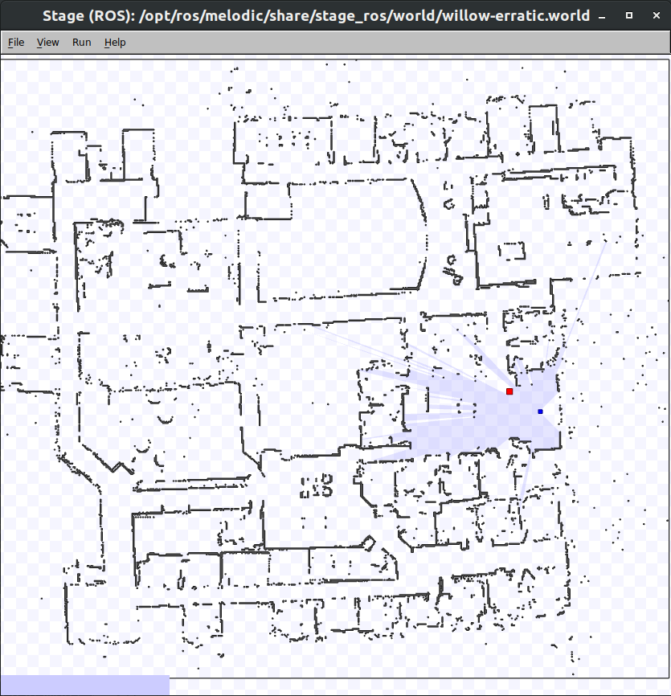
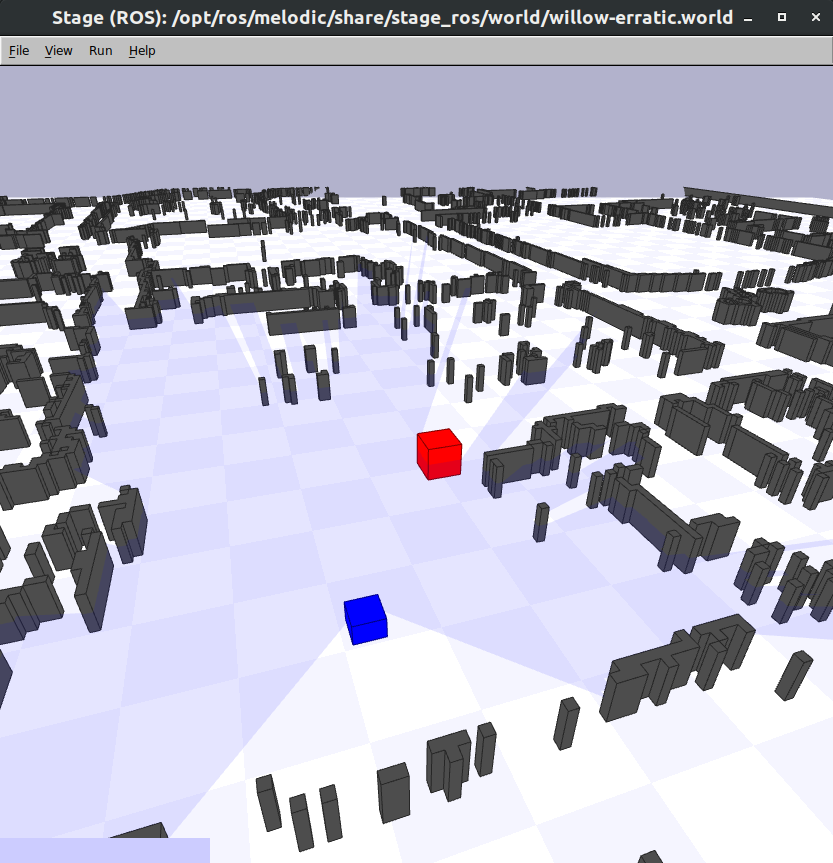
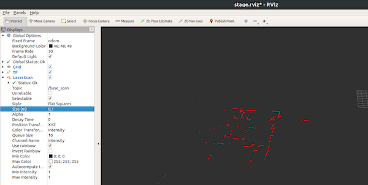
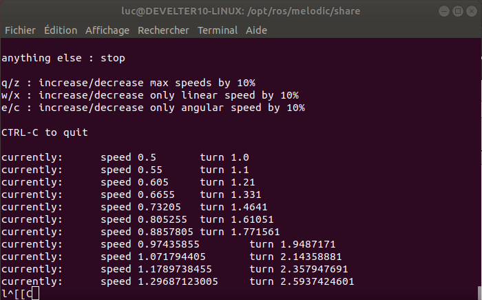
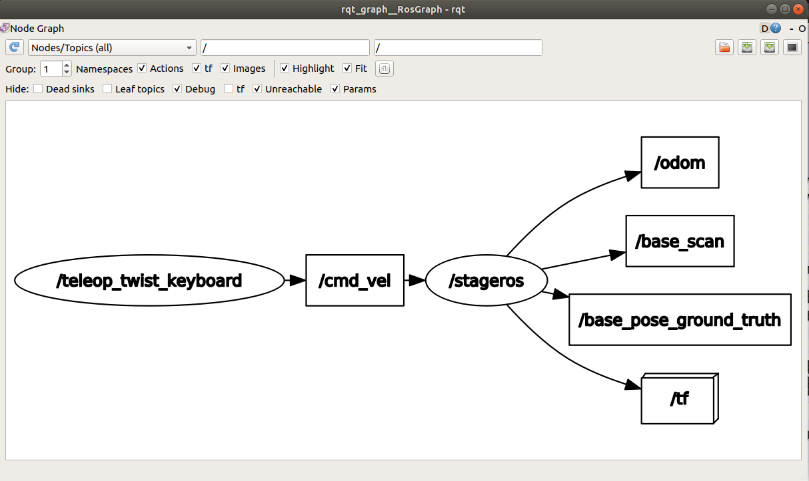
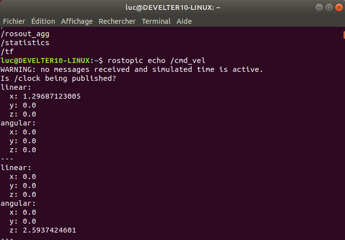
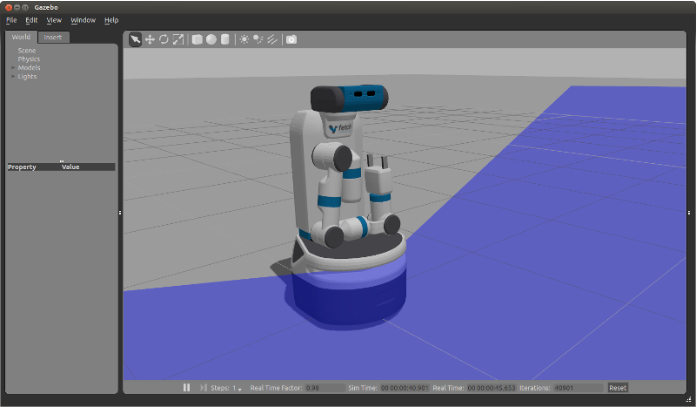

# Goal of this Tutorial

- Discover and use ROS tools: `roscore`, `rosrun`, `roslaunch` (launch files), `rqt_graph`, catkin, `rviz`
- Discover robotics simulators: **stage** (2d), **gazebo** (3d)

# ROS Prerequisites

- ROS correctly installed (cf. [Setup](1-ros-basics.md))
- A *catkin workspace* directory (usually `~/catkin_ws`) in which you will create your catkin packages or install third party ones

# 2d Simulation with Stage

Let's start with a first 2d ROS simulation with the [stage](http://wiki.ros.org/stage) simulator.

>Stage provides several sensor and actuator models, including sonar or infrared rangers, scanning laser rangefinder, color-blob tracking, fiducial tracking, bumpers, grippers and mobile robot bases with odometric or global localization.

## Stage Installation

Check that stage is installed:

```console
$ dpkg -l | grep stage
ii  ros-noetic-stage                            4.3.0-1focal.20210423.222334               amd64        Mobile robot simulator http://rtv.github.com/Stage
ii  ros-noetic-stage-ros                        1.8.0-1focal.20210727.075341               amd64        This package provides ROS specific hooks for stage
```

Otherwise, install it:

```console
$ sudo apt update
$ sudo apt install ros-noetic-stage ros-noetic-stage-ros
```

You can explore the files installed by these two packages:

```console
$ roscd stage_ros
```

## Stage Simulation with one Robot

[Source](http://wiki.ros.org/stage/Tutorials/SimulatingOneRobot)

```console
$ roscore
...
# Launch stage in another shell
$ rosrun stage_ros stageros $(rospack find stage_ros)/world/willow-erratic.world
```



By pressing `r`, the stage simulation is rendered in 3d:



You can use various ROS tools to analyse what is involved in this simulation.

```console
# show the ROS graph (nodes + topics)
$ rqt_graph

# list the ROS topics and available data
$ rostopic list

# read the willow-erratic.world file
$ gedit $(rospack find stage_ros)/world/willow-erratic.world

# launch a pre-configured rviz
$ rviz -d $(rospack find stage_ros)/rviz/stage.rviz
```

[rviz](http://wiki.ros.org/rviz) is a very useful and versatile tool to visualize data that goes through topics.



## Controlling the Simulated Robot

Launch a simple node to control a robot using keyboard:

```console
$ roslaunch turtlebot_teleop keyboard_teleop.launch
```

Use `rqt_graph` to see the graph of ROS nodes and the topics they use to communicate.
Why you cannot control the robot?

Create a new catkin package named `my_teleop` using the `catkin_create_pkg` command line tool (cf. [catkin package creation](http://wiki.ros.org/ROS/Tutorials/CreatingPackage)).

```console
$ cd ~/catkin_ws/src
$ catkin_create_pkg my_teleop std_msgs rospy
```

Then, write your __own__ launch file to control the robot by copying and modifying `keyboard_teleop.launch` from the package __turtlebot_teleop__.
You should have the nodes and topics as depicted below.



Use `rqt_graph` to see the graph of ROS nodes and the topics they use to communicate.



Using `rostopic echo`, you see the data exchanged.



Try to issue a command (`rostopic pub`) that mimic keyboard teleoperation by publishing data directly into the topic `/cmd_vel`, it should make the robot move into stage.

Find how to control a robot with a joypad (xbox, ps3/4 controllers).

## A program to control the simulated robot

Write a publisher node in Python to make moving the simulated robot in stage by publishing data into the topic `cmd_vel`.

# Versioning

Document your package by adding a Readme inside (mandatory).
Commit and push your new catkin package into your git repository.

```console
$ cd ~/catkin_ws/src/my_teleop
$ git status # to view modified files
$ git add -A # to add all files into the staging area
$ git commit -m "my slam package"
$ git push
```

You can now check on the web interface of your git repository to see these committed files.

There are tons of ressources on the Web to learn more about git.
You can find your own or have a look at this one: [learngitbranching](https://learngitbranching.js.org/).


# **Your** first SLAM launch file

Create a `larm1_slam` catkin package, create a *launch file* named `robot_stage.launch` that launches a full-fledge simulation using stage with one robot equipped with a 2d laser ranger.
The [launch file documentation](http://wiki.ros.org/roslaunch).
Once this file finished, you should be able to launch everything with this single command line:

```console
roslaunch larm1_slam robot_stage.launch
```

`rviz` might be launched also using an optionnal argument to the launch file.

```console
roslaunch larm1_slam robot_stage.launch rviz:=true
```

When a launch file uses a simulator instead of a real robot, it is mandatory to ensure that ROS uses the simulator clock instead of the real clock of your machine (cf. [ROS clock documentation](http://wiki.ros.org/Clock)).
To achieve this, add this line into your launch file:

```xml
	<param name="/use_sim_time" value="true">
```

## Advanced Stage

You can customize your simulation by writing your own `.world` file and for example:
- change the map
- change the robot model (sensors, body shape, ...)
- add multiple robots into the scene
- ...

You can find `world` file examples into the `stage_ros` and `stage` catkin packages as well as read the [documentation](https://player-stage-manual.readthedocs.io/en/stable/WORLDFILES/).

# Gazebo Simulator

[Gazebo](http://gazebosim.org/) simulator makes it possible to rapidly test algorithms, design robots, perform regression testing, and train AI system using realistic scenarios. Gazebo is integrated with ROS (cf. [Gezebo ROS](http://wiki.ros.org/gazebo_ros_pkgs)) and supports various robots out of the box.

Gazebo is heavily used by the DARPA challenges (cf. [Wikipedia](https://en.wikipedia.org/wiki/Gazebo_simulator)).
You can see videos online ([example](https://www.youtube.com/watch?v=v6-heLIg85o)) and even load the maps and robot model that are available.

Follow [this tutorial](http://docs.fetchrobotics.com/gazebo.html) to simulate the *freight robot* (available at IMT Lille Douai).



```console
$ roslaunch fetch_gazebo playground.launch robot:=freight
```

You can launch your teleoperation node to control the freight base.


In this lecture, you will use turtlebot2 robots equipped with a laser.
We call it __tbot__ and you can simulate it in  gazebo:

```console
roslaunch tbot_gazebo start_world.launch
roslaunch tbot_gazebo spawn_tbot.launch
```

Write and commit a new launch file into your `larm1_slam` package that launches everything:

```console
roslaunch larm1_slam tbot_gazebo.launch rviz:=true teleop_keyboard:=true
```

## Final Exercice

1. create a bag file that only record `/cmd_vel` while you are teleoperating a robot in a simulated map
2. then replay this bag file on a fresh simuation

You can now reproduce experimentation in the same conditions.

<!-- gazebo models
	cd ~/.gazebo/
	rm -fr models
	wget https://bitbucket.org/osrf/gazebo_models/get/e6d645674e8a.zip
	unzip osrf*.zip
	rm *.zip
	mv osrf* models
	-->
